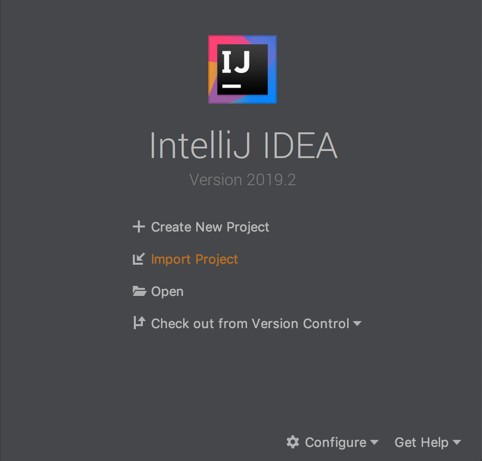
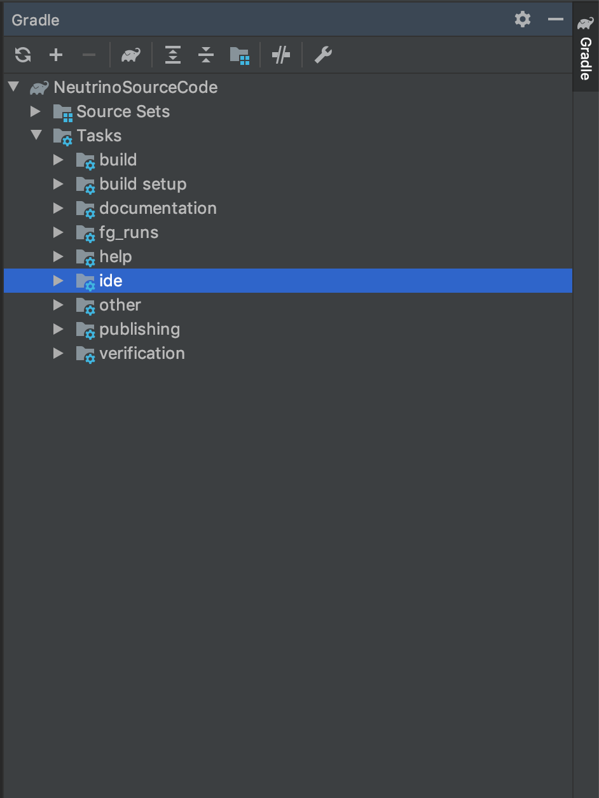
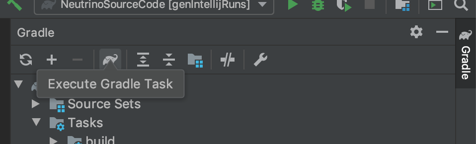
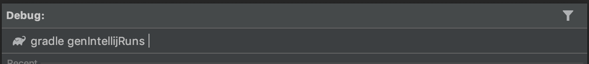
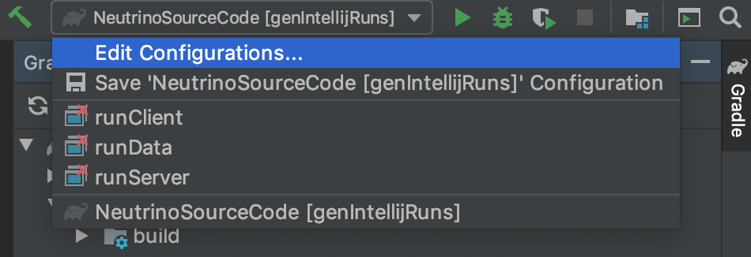
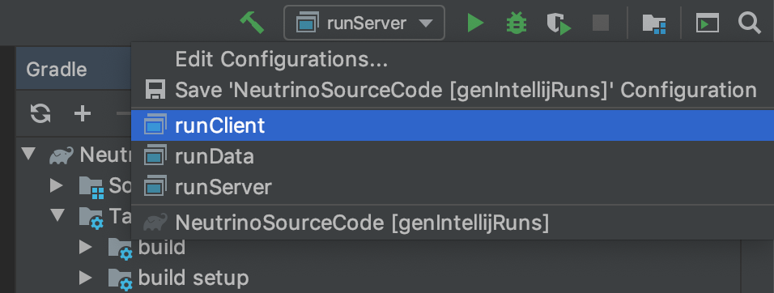

本教程假定读者已有 Java 编程经验，所以在教程中不会对一些编程术语进行过多对介绍。

本教程针对的是 Minecraft 1.13/ 1.14 开发，对之前和之后对 Minecraft 版本仅有有限的参考意义。

我们在进行 mod 开发对第一步是配置开发环境，我们将会用到以下工具及其软件
```
JDK 1.8
Forge MDK
Intellij IDEA
一个合适的代理
```
*请注意笔者不欢迎任何对盗版行为，如果你无力承担授权费用请使用 Community 版本*

*请不要安装任何形式对汉化包，如果你无法理解 Inellij 的界面请提升英文水平之后再学习*

因为，本文假定读者已经有 Java 编程经验，所以对 JDK 和 Intellij 的安装过程略去不提。

下面开始讲解具体的环境配置

首先先在官网，下载 Forge 的 MDK （Mod Development Kit）。


下载完成之后，解压完目录结构如下
```
├── CREDITS.txt
├── LICENSE.txt
├── README.txt
├── build.gradle
├── changelog.txt
├── gradle
│   └── wrapper
│       ├── gradle-wrapper.jar
│       └── gradle-wrapper.properties
├── gradle.properties
├── gradlew
├── gradlew.bat
└── src
    └── main
        ├── java
        │   └── com
        │       └── example
        │           └── examplemod
        │               └── ExampleMod.java
        └── resources
            ├── META-INF
            │   └── mods.toml
            └── pack.mcmeta
```
接着用 Intellij 导入项目


注意这里请选择 `build.gradle` 。


接着请耐心等待，因为网络的原因导入过程会持续很久，如果出现问题可以尝试给 `gralde` 配置代理。

请将:

`org.gradle.jvmargs=-DsocksProxyHost=127.0.0.1 -DsocksProxyPort=你代理软件的socks本地端口` 

添加进 `gradle.properties` 文件中。

如果导入出现错误，点击右侧 `gradle` 面板的「循环」按钮即可重新导入。


当右侧 `gradle` 面板出现以下内容时候即代表导入完毕。


出于兼容性的问题，面板中似乎会找不到 `genIntellijRuns` 这项 task，所以我们得手动调用。

点击「大象」按钮


输入 `genIntellijRuns`


成功执行以后，Run 面板里应有如下内容


点击 `Edit COnfiguratiosn` 按钮，修改 `Application`中的所有子项的 `Use classpath of Module`。


修改完毕之后，应该没有红叉显示。

这时点击 Run 面板的 `runClinet` 即可启动 Minecraft 客户端。
