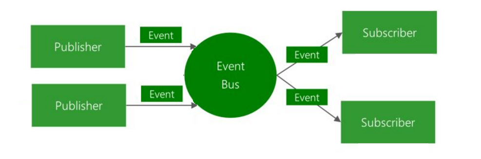

在本节中我会为大家讲解一下两个重要的概念，「事件驱动开发」以及「注册表」。

Minecraft mod 的开发利用了「事件驱动开发」的技术。要回答什么是「事件驱动开发」我们就得先了解什么是「事件」。

「事件」可以用一句话来形容「当发生了某件事就要做一个动作」这就是一个事件，以 Minecraft 的游戏机制举例：「当玩家手持木棍右击时」即为一个典型的事件，这时身为开发者的你可以选择「监听」某个事件，比如你可以「监听」「当玩家手持木棍右击时」这个事件，然后自定义一个行为，比如你可以自定义「当玩家手持木棍右击时，召唤出一道雷劈玩家」，这样就实现了一个功能，在 mod 开发里自定义行为一般会被封装成一个函数。

那么 Forge 是怎么知道你监听了一个事件呢？Forge 使用了名为「事件总线（Even Bus）」的机制，对于了解设计模式的同学这其实就是「观察者模式」。对于不了解设计模式的同学来说，「事件总线」的原理是开发者主动的把「事件处理器」（在我们的例子里就是「召唤一道雷劈玩家」这个函数）注册到「总线」里，所谓的「总线」你可以想像成一个列表，注册完成之后 Forge 就能在事件发生的时候自动的从「总线」（想象中的列表）里找到你的「事件处理器」然后调用它。

接下来我们讲解一下什么是「注册表」，首先我们得先讲解一下什么是「注册」，「注册」简而言之就是让 Minecraft 知道到哪里去寻找的你提供的资源的过程，比如你方块的材质，游戏中的音效，GUI 的背景图片等等。而注册表就是一个保存注册关系的地方。
> 游戏中大部分需要注册的东西都是由Forge注册表(Registry)来处理的,注册表是一个类似于键值映射的对象,它会自动将整数ID分配到值上。

以上内容引用自官方文档，我认为已经把什么是「注册表」说的很明白了。

