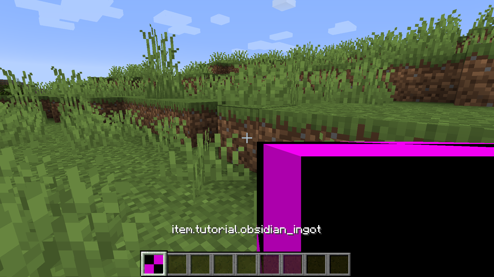

在这一小节中，我们的主要目的是创建我们 mod 的第一个物品，我们的目标是在 Minecraft 的世界里添加一个「黑曜石碇」，废话不多说我们开始吧。

首先在 `src/main/java/com/otakusaikou/tutorial/` 下创建一个类，类名字为 `RegistryHandler`，接着再创建一个文件夹名字为`items`，然后在 `src/main/java/com/otakusaikou/tutorial/items/` 创建两个类，分别是 `ModItems` 和 `ObsidianIngot`，创建完成以后的目录结构如下：
```
src
└── main
    ├── java
    │   └── com
    │       └── otakusaikou
    │           └── tutorial
    │               ├── Main.java
    │               ├── RegistryHandler.java
    │               └── items
    │                   ├── ModItems.java
    │                   └── ObsidianIngot.java
    └── resources
        ├── META-INF
        │   └── mods.toml
        └── pack.mcmeta
```
`ObsidinaIngot` 从名称上就可以看出，这个类是我们马上要创建的「黑曜石碇」的实现类，而 `RegistryHandler` 如果你已经读过上一节，那么你大概就能猜出我们会在这个类中注册物品，因为注册物品时候需要提供一个实例，所以我们需要在一个统一的地方实例化我们的实现类，这正是 `ModItems` 这个类的作用。

我们先来看 `ObsidianIngot` 的代码
```java
package com.otakusaikou.tutorial.items;

import net.minecraft.item.Item;
import net.minecraft.item.ItemGroup;

public class ObsidianIngot extends Item {
    public ObsidianIngot(String name, ItemGroup group) {
        super(new Item.Properties().group(group));
        this.setRegistryName(name);
    }
}
```
在 Minecraft 的世界里，所有的物品都需要继承 `Item` 类，我们的物品自然不例外，紧接着是
```java
super(new Item.Properties().group(group));
```
等等 `Item.Properties()` 这是什么？让我们看看它的源代码。
```java
...有所省略
public static class Properties {
      private int maxStackSize = 64;
      private int maxDamage;
      private Item containerItem;
      private ItemGroup group;
      private Rarity rarity = Rarity.COMMON;
      /** Sets food information to this item */
      private Food food;
      private boolean canRepair = true;
...
```
从它的属性中我们不难猜出，这个是设置物品的一些通用属性的类，而 `ItemGroup` 决定则是物品在创造模式会出现在哪一栏里。

最后是 `this.setRegistryName(name);` 这句话设置了物品的 `RegistryName`，这个名字决定了物品在游戏命令中的名字、物品模型文件名字（什么是模型，我们之后再提）以及在语言文件中条目的名字等。

好的，实现类已经写完了，那么我们需要在 `ModItems` 里实例化它， `ModItems` 的内容如下。
```java
package com.otakusaikou.tutorial.items;

import net.minecraft.item.ItemGroup;

public class ModItems {
    public static ObsidianIngot obsidianIngot = new ObsidianIngot("obsidian_ingot", ItemGroup.MATERIALS);
}
```
可以看到 `ModItems` 的内容非常简单，无非是创建了一个公开的实例而已,其中的 `ItemGroup.MATERIALS` 你可以换成你喜欢的任何一个标签，它们都在 `ItemGroup` 之下，比如你想让你的物品出现在「食物」这一栏你就可以改成 `ItemGroup.FOOD`。而 `"obsidian_ingot"` 这个 `RegistryName` 请不要出现大写和特殊字符，如果需要隔开几个单词请用下划线。

接下来就是一个难点了，我们来看 `RegistryHandler` 里的内容
```java
package com.otakusaikou.tutorial;

import com.otakusaikou.tutorial.items.ModItems;
import net.minecraft.item.Item;
import net.minecraftforge.event.RegistryEvent;
import net.minecraftforge.eventbus.api.SubscribeEvent;
import net.minecraftforge.fml.common.Mod;

@Mod.EventBusSubscriber(bus = Mod.EventBusSubscriber.Bus.MOD)
public class RegistryHandler {
    @SubscribeEvent
    public static void onItemRegistry(RegistryEvent.Register<Item> event){
        event.getRegistry().register(ModItems.obsidianIngot);
    }
}
``` 
诶诶诶，这是什么？怎么看上去这么复杂。

别着急我们一点一点来看，首先就是
```java
@Mod.EventBusSubscriber(bus = Mod.EventBusSubscriber.Bus.MOD)
```
`@Mod.EventBusSubscriber` 这是一个 Java 的注释，这个注释的意思是：这个类中所有带 `@SubscribeEvent` 注释的公开的静态方法都是「事件处理器」（还记得我们上一节提到的「事件处理器」吗？）

这个注释可以带一个参数 `bus`，这个参数指定了「事件处理器」要注册进去的「总线」是什么（还记得上一节提到的「总线」吗，想象一个巨大的列表），有两个选项分别是名为 `Mod.EventBusSubscriber.Bus.FORGE` 的 Forge 总线和名为 `Mod.EventBusSubscriber.Bus.MOD` 的 Mode 总线，因为我们注册「事件处理器」所需要的事件在 Mod 总线里，所以这里填的是 `Mod.EventBusSubscriber.Bus.MOD`

接下来就是一个被 `@SubscribeEvent` 注释的公开的静态方法，它的参数类型是 `RegistryEvent.Register<Item>`，表明了我们要注册的事件是 `RegistryEvent.Register<Item>`，而在函数里面就是一句非常简单的先获取注册表再注册物品的语句，就不多加说明了。

完成这些以后，启动游戏你就可以看到我们第一个物品了。


