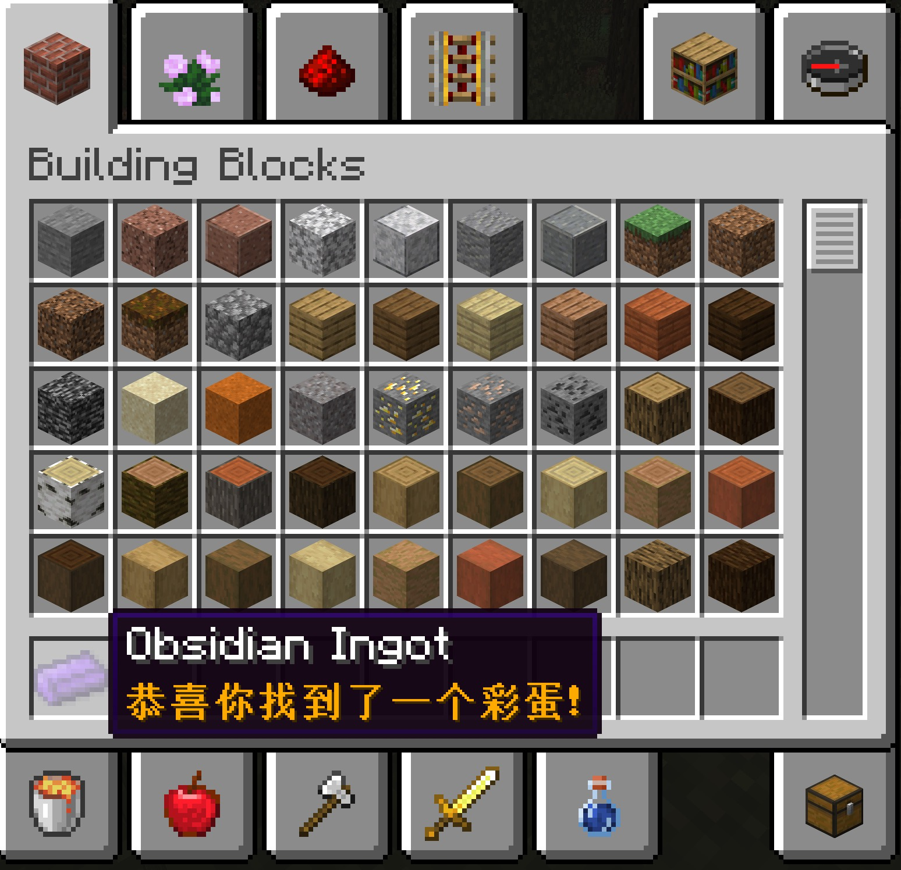

我们在上一节已经创建了「黑曜石碇」，但是光秃秃的一个物品也没有什么变化一点也不好玩。

不如给我们创建的第一个物品添加个彩蛋怎么样？让我想想是个什么样子的彩蛋呢……给物品一个特定的 NBT 标签就可以在物品的介绍栏里显示一句话怎么样？说干就干。

首先我们在我们的 `ObsidianIngot` 类里重写名为 `addInformation` 的方法，这个方法有四个参数，我们一一介绍。

第一个参数是 `ItemStack stack`：你可能有些奇怪 `ItemStack stack` 中的 `ItemStack` 是什么，其实很简单 `ItemStack` 代表了一堆物品,而且这堆物品的数量不定。Minecraft 中玩家背包里的东西、手中拿着的东西都是 `ItemStack` ，而且 `ItemStack` 还允许添加 NBT 标签。

第二个参数 `@Nullable World worldIn`：这个参数代表的是玩家所处的纬度，比如「下届」和「普通世界」的区别，我们不会用到这个参数，你可以尝试利用这个参数埋一个拿着黑曜石碇去下届时会触发的彩蛋。

第三个参数 `List<ITextComponent> tooltip` 就是介绍信息了。

第四个参数 `ITooltipFlag flagIn` 是为了工具信息显示存在的，在这里我们用不到。

```java
@Override
public void addInformation(ItemStack stack, @Nullable World worldIn, List<ITextComponent> tooltip, ITooltipFlag flagIn) {
    CompoundNBT compoundNBT = stack.getTag();
    if (compoundNBT != null && compoundNBT.getBoolean("bingo")) {
        tooltip.add(new TextComponent() {
            @Override
            public String getUnformattedComponentText() {
                return "恭喜你找到了一个彩蛋！";
            }

            @Override
            public ITextComponent shallowCopy() {
                return null;
            }
        }.setStyle(new Style().setColor(TextFormatting.GOLD).setBold(true)));
    }
}
```
上面是具体实现的代码，我们一句一句来分析，首先是：
```java
CompoundNBT compoundNBT = stack.getTag();
```
在 Minecraft 中，NBT 标签的类型就是 `CompoundNBT`。那么这句话的意思非常简单，就是从 `stack` 从获取 NBT 信息，如果没有话就返回 `null`，具体的实现你们可以利用 IntelliJ 的代码跳转功能查看。
```java
if (compoundNBT != null && compoundNBT.getBoolean("bingo"))
```
`getBoolean` 传入的是 NBT 标签的键值，NBT 标签的每一种类型都有自己的 `get` 方法大家可以按需使用。在这里我们判断了黑曜石碇有没有 NBT 信息，如果有的话有没有一个名为 `bingo` 类型为 `boolen` 值为 `true` 的标签，如果还有的话那么说明玩家找到我们的彩蛋了，我们可以向玩家显示一句话。

而 `tooltip.add()` 这个方法的作用就是向物品的提示栏里添加内容，参数的类型是 `ITextComponent`，这里我们用的是实现了 `ITextComponent` 接口的 `TextComponent` 类，`TextComponent` 类代表了带有「样式」的一段文字。
```java
new TextComponent() {
            @Override
            public String getUnformattedComponentText() {
                return "恭喜你找到了一个彩蛋！";
            }

            @Override
            public ITextComponent shallowCopy() {
                return null;
            }
}
```
以上的内容是一个匿名内部类，`TextComponent` 必须要重写 `getUnformattedComponentText` 和 `shallowCopy` 这两个方法。`getUnformattedComponentText` 决定了显示的内容，所以直接 `return` 你的彩蛋就行，这里我们用不到 `shallowCopy` 方法，保持默认就好。

新建好 `TextComponent` 实例以后，我们可以为他添加样式，而样式的类型为 `Style`。
```java
.setStyle(new Style()
               .setColor(TextFormatting.GOLD
               .setBold(true)
          )  
```
这里也没什么好说的，大家一眼就能看出来在做什么，我们为我们的彩蛋添加了「金色」和「加粗」两种样式，值得一提的是 `TextFormatting` 类下面有许多预设好的颜色，大家可以拿来直接用。

以上我们的彩蛋就实现完毕了，打开游戏，输入以下命令
```
/give @p tutorial:obsidian_ingot{bingo:1} 1
```
你就可以看到一个带彩蛋的黑曜石碇了！



